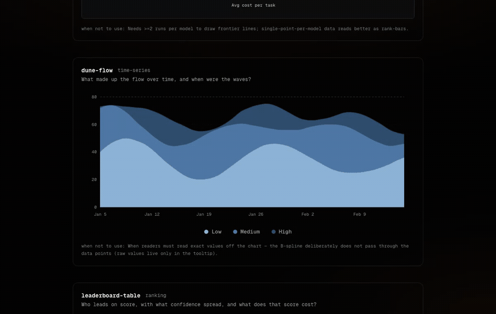

# vizcn

[](https://www.npmjs.com/package/vizcn)
[](LICENSE)

**An SVG viz registry built for coding agents first.** Copy-paste forms your
AI agent assembles from a catalog — shadcn-style, zero chart libraries
(no d3, no recharts: every form is hand-drawn inline SVG).



Live shelf with every form rendered: **[vibecoding.tech/vizcn](https://vibecoding.tech/vizcn)**

Instead of teaching your agent to invent charts, give it a **catalog of
named forms** and one rule: *pick the form by the question the reader must
answer in 2 seconds — never invent a new one.* The catalog is machine-readable
([`catalog.json`](catalog.json)), the rule ships in [`AGENTS.md`](AGENTS.md).

## Setup by agent (the intended path)

Nobody installs viz libraries by hand anymore — your coding agent does.
Paste this prompt into it (also available as `npx vizcn prompt`):

```text
Add a data visualization to this project from the vizcn registry:

1. Fetch https://vibecoding.tech/vizcn/catalog.json — every form declares the
   question it answers, whenToUse, antiUse, and an `example` (reference
   usage); the top-level `skins` lists the visual registers.
2. Pick the form whose question matches what my data needs to answer.
   Respect antiUse. If no form fits, stop and ask — never invent a chart.
3. Install: npx shadcn@latest add https://vibecoding.tech/vizcn/r/<name>.json
   (no shadcn in the project? run `npx shadcn@latest init -d` once,
   or copy the form file from the repo).
4. Pick a skin from `skins`: core is the default; for another register
   wrap the chart's subtree in its class (e.g. .vz-paper for print,
   .vz-terminal for dark terminal). Skins are token packs — no per-form work.
5. The install adds namespaced --vz-* tokens. The status trio
   (--vz-good/mid/bad) and per-series colors are brand-neutral
   placeholders — remap the trio and pass `color` props to match my brand.
6. Feed my real data via props, following the form's `example` — the
   demo data is fictional reference.
```

To make the rule permanent, drop this into your project's `AGENTS.md`:

```markdown
## Data visualizations
Never invent charts or add chart libraries. Use the vizcn registry:
pick a form by the question it answers in
https://vibecoding.tech/vizcn/catalog.json (respect each form's antiUse,
copy its `example`), install via
`npx shadcn@latest add https://vibecoding.tech/vizcn/r/<name>.json`,
apply a skin class from the catalog's `skins` if the surface calls for it,
remap --vz-good/mid/bad to the brand palette, wire real data via props.
```

Programmatic channel: add the namespace to `components.json` and any
shadcn-MCP-aware agent browses and installs the catalog natively —

```json
{ "registries": { "@vizcn": "https://vibecoding.tech/vizcn/r/{name}.json" } }
```

## Install by hand (two equivalent ways)

```bash
npx shadcn@latest add https://vibecoding.tech/vizcn/r/dune-flow.json
npx vizcn add dune-flow   # pointer CLI; `npx vizcn` lists the catalog
```

`npx shadcn` here is not a dependency — it is a one-shot CLI npx fetches on
the fly; the only real requirement is a React project with `components.json`
(`npx shadcn@latest init -d` once). Tokens (`--vz-*`, namespaced — installing
vizcn never repaints your app) and the series palette come along automatically
via registry dependencies. Optional motion kit:
`npx shadcn@latest add https://vibecoding.tech/vizcn/r/motion.json`.

Mirror on [21st.dev](https://21st.dev/@eugeneshilow/library/vizcn) — library
`vizcn · by vibecoding.tech`, same forms, palette inlined per file (21st's
publish flow takes one component file + one demo each):
`npx @21st-dev/cli add @eugeneshilow/<name>`. The canonical registry with
tokens, skins and the machine-readable catalog stays on the shelf above.

uiverse.io (HTML + CSS only): the dune-flow hero as a static card —
[uiverse.io/eugeneshilow/green-bear-100](https://uiverse.io/eugeneshilow/green-bear-100),
source in [`showcase/uiverse/`](showcase/uiverse/README.md).

## Catalog

<!-- catalog:start -->
| form | answers the question | family | when NOT to use |
| --- | --- | --- | --- |
| `bench-matrix` | How do these models compare across many benchmarks at once? | matrix | Trends over time or more than ~6 models — use a time-series form or a ranking board instead of a wide table. |
| `bubble-field` | How is the pool scattered across two axes? | distribution | Few points with runs per entity and an efficiency story — use frontier-board; exact value reading — use a table. |
| `delta-bars` | Who is ahead today, and by how much? | time-series | Not for more than 2 rivals or for absolute magnitudes — use race lines or stacked forms instead. |
| `dumbbell-range` | How far apart are the two values per row, and who sits where? | ranking/comparison | Not for more than 2 points per row (use a range strip or box plot) and not for time series — use lines. |
| `dune-flow` | What made up the flow over time, and when were the waves? | time-series | When readers must read exact values off the chart — the B-spline deliberately does not pass through the data points (raw values live only in the tooltip). |
| `frontier-board` | Which model delivers the most score per dollar (or token), and at what effort level? | ranking | Needs >=2 runs per model to draw frontier lines; single-point-per-model data reads better as rank-bars. |
| `heat-strip` | Is this thing alive — how did its activity move over the last year? | time-series | Not for exact value reading or short ranges (<12 weeks) — use a column chart instead. |
| `leaderboard-bars` | Who clears the bar, with what spread, and at what cost? | ranking | Single-metric rankings without spread or metric columns — use rank-bars; past ~12 rows the board outgrows a screen and labels stop scanning — use leaderboard-table. |
| `leaderboard-table` | Who leads on score, with what confidence spread, and what does that score cost? | ranking | Wide-figure genre (min-width ~700px) — not for narrow containers or mobile cards; for a single metric without spread or economy columns, rank-bars is lighter. |
| `paired-bars` | How do two measurements of the same subjects compare? | comparison | More than two measurements per subject — use a table or bench-matrix; two rivals over time — use delta-bars. |
| `rank-bars` | Who leads this ranking, and by how much? | ranking | Not for time series, part-to-whole composition, or more than ~10 rows — use a table or sparklines instead. |
| `rank-slope` | How does the ranking reorder between two contexts? | ranking | More than two contexts — use lines; when only the gap per item matters — use dumbbell-range. |
| `share-strip` | What makes up the whole, in one strip? | composition | Hierarchies or many small categories — use treemap; comparing composition across subjects — use verdict-stack. |
| `stacked-activity` | What makes up each day's volume, and how does it breathe day to day? | time-series | Comparing exact values of individual segments across days (inner segments have no common baseline) or fewer than 5 days. |
| `treemap` | How is the whole split up, and who dominates? | composition | Not for close values (areas are hard to compare precisely) or deep hierarchies (flat only) — use rank bars or a nested treemap library instead. |
| `value-columns` | How do these few values stack up side by side? | ranking | Not for many items (>8) or time series — use rank bars or lines instead. |
| `verdict-stack` | What do each subject's outcomes consist of? | composition | Reading exact segment values (no common baseline) — use a table; time series — use stacked-activity. |
<!-- catalog:end -->

## Usage

Data goes in via props; every component ships with a deterministic demo
(`registry/<name>/<name>.demo.tsx`). Colors follow your entities — pass `color`
per series, or the neutral palette steps in.

### Skins and themes

The registry dependency installs the namespaced `--vz-*` tokens automatically.
Skin is the visual register above polarity: core is the default, terminal is
dark-only, and paper is a light-only print/editorial register. Within core,
light is the default; put `.dark` on the app root for the standard dark tone,
or use `.vz-terminal` / `.vz-paper` on a root or subtree. For manual setup,
copy `theme.css` into global CSS; its source-level standard-dark selector is
`.vz-dark`, while the skin selectors are unchanged.

## Maintenance

Curated static snapshot: copy-paste, no runtime dependency, nothing to
upgrade. Issues are open for bug reports on the forms; PRs may lag — this
registry is a byproduct of a production system, not a product team.

21st.dev mirror: `pnpm 21st:build` writes self-contained pairs to `dist/21st/`
(gitignored), `pnpm 21st:publish [name ...]` pushes them into the library
(`npx @21st-dev/cli login` once; a revision of an already published form
needs `TWENTYFIRST_PUBLISH_ARGS="--component component:<id>"`, ids via
`npx @21st-dev/cli components --json`).

## Author

Built by [Evgeny Shilov](https://github.com/eugeneshilow) ·
[@eugeneshilow](https://x.com/eugeneshilow) · next drops:
[vibecoding.tech/vizcn](https://vibecoding.tech/vizcn)

Not affiliated with [shadcn](https://ui.shadcn.com) — vizcn is an
independent registry that follows the shadcn registry spec.
